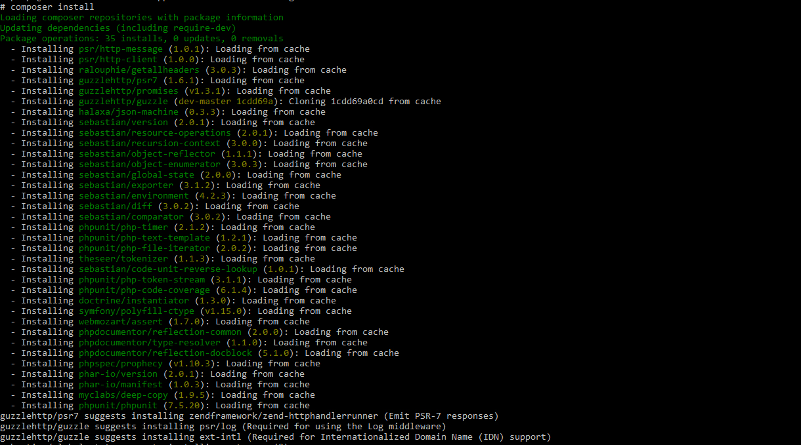
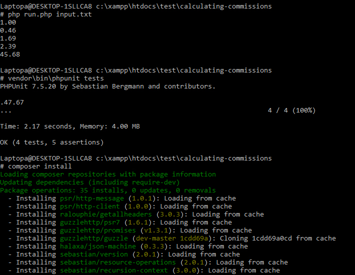
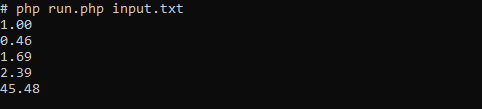
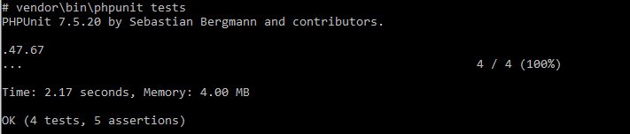
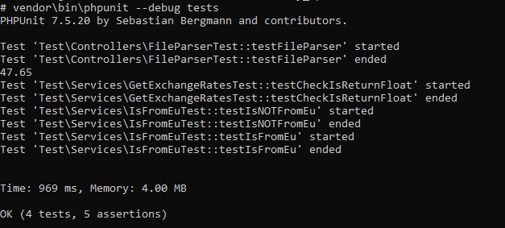

# Experimental project for calculating commissions fees

Simple project that parses transactions from separate json file and calculate the commissions.

## Runing
- The application has been tested on PHP versions 7.4.4 and 7.3.12
- Clone project from github
- Install dependencies from composer.json:

```shell
composer install
```

- Output. Run:

```shell
php run.php input.txt
```




### Start phpunit tests

```
vendor\bin\phpunit tests
```

